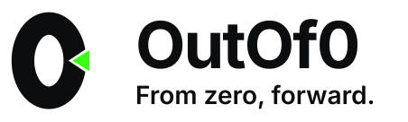

<picture>
  <source media="(prefers-color-scheme: dark)" srcset="./brand/logos/readme-banner-dark.svg">
  
</picture>

**Local-first developer tools.**

We're building them to serve you well — 65 and counting, all MIT licensed, none asking for your data.

---

An independent studio, shipping continuously for the browser, the editor, the terminal, and the
AI client. One rule holds across all of it: the input stays on your machine, and the tool stays
out of your way.

| # | Product | What it does |
| :-: | --- | --- |
| 01 | **[Kitland](https://kitland.dev)** [source](https://github.com/outof0/kitland) | 65 local-first developer tools — format, encode, generate, inspect, transform. Web app, browser extension, VS Code extension, and MCP server. Nothing is uploaded. |
| 02 | **[AnyPick](https://anypick.dev)** [source](https://github.com/outof0/anypick) | Points any AI coding CLI at any account you already own. `anypick use claude --with grok/work` runs Claude Code on your Grok account. Auth snapshots, local proxies, protocol conversion. |
| 03 | **[GitView](https://gitview.dev)** [source](https://github.com/outof0/gitview) | A Git workspace for VS Code. True three-way merge built from real Git index stages (`:1:` `:2:` `:3:`) instead of `<<<<<<<` markers, plus history, blame, compare, and hosted review. |

### Why this shape

Most tools start by asking for your data. We think the opposite is more useful — it is why
Kitland has no upload step, why AnyPick routes to accounts you already pay for instead of
reselling access, and why GitView reads your local Git index rather than guessing from a diff.

### This repository

Also the source for the OutOf0 landing page — Astro, deployed to Cloudflare Pages on every
push to `main`. Setup, local development, and deployment live in
[`CONTRIBUTING.md`](./CONTRIBUTING.md). Brand tokens and logo sources are in [`brand/`](./brand/).

[outof0.com](https://outof0.com) · MIT licensed · [hello.outof0@gmail.com](mailto:hello.outof0@gmail.com)
